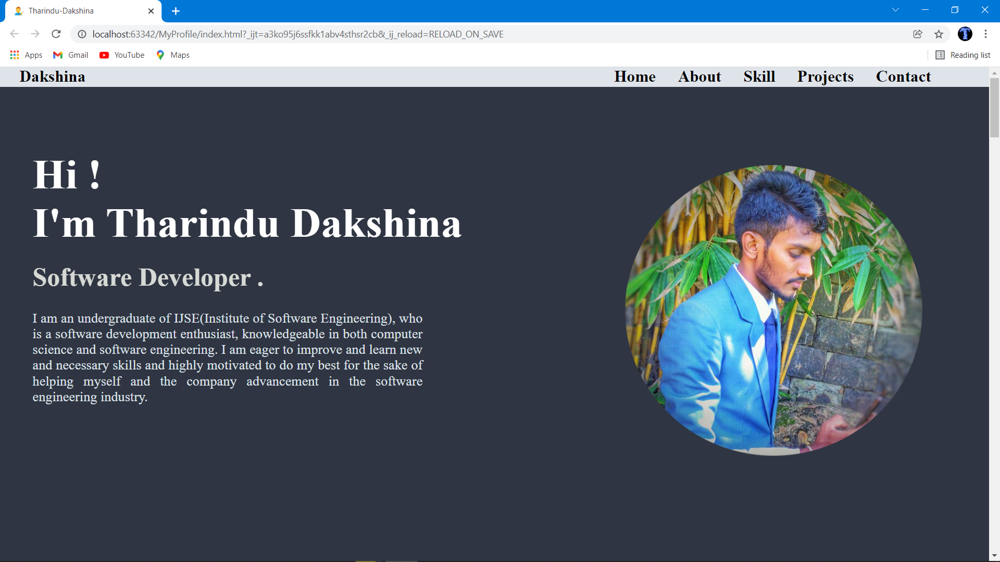
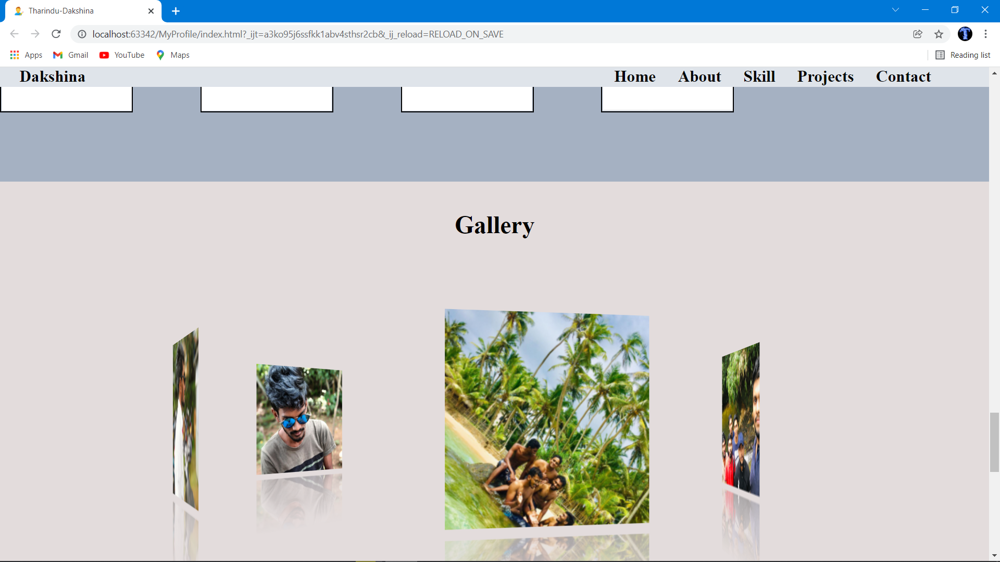
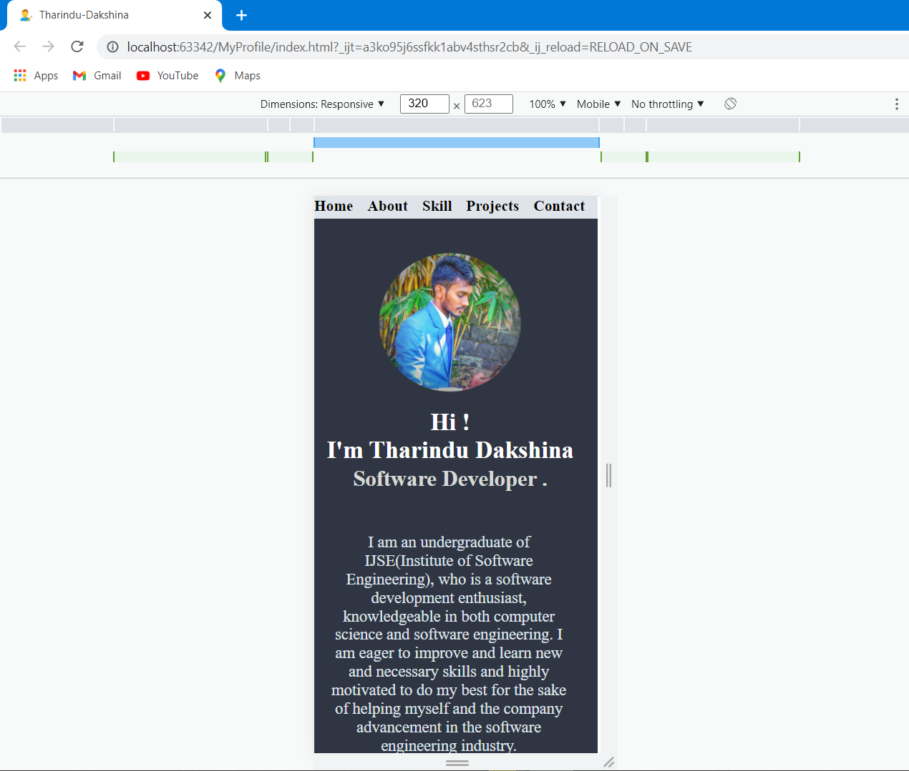
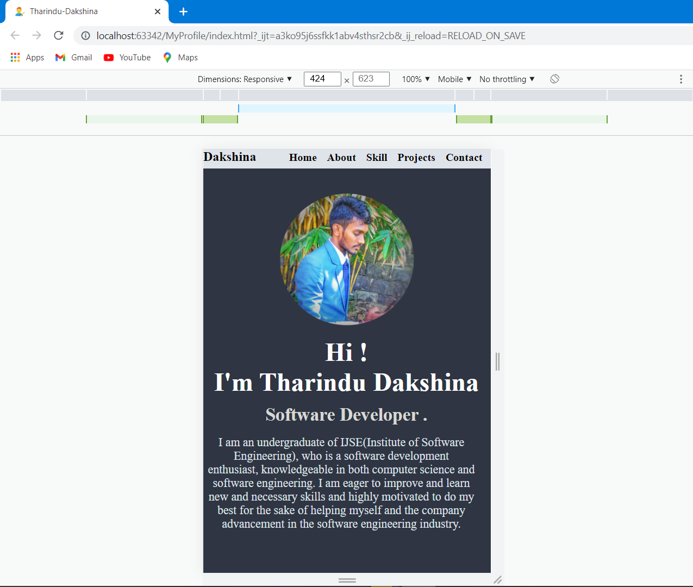
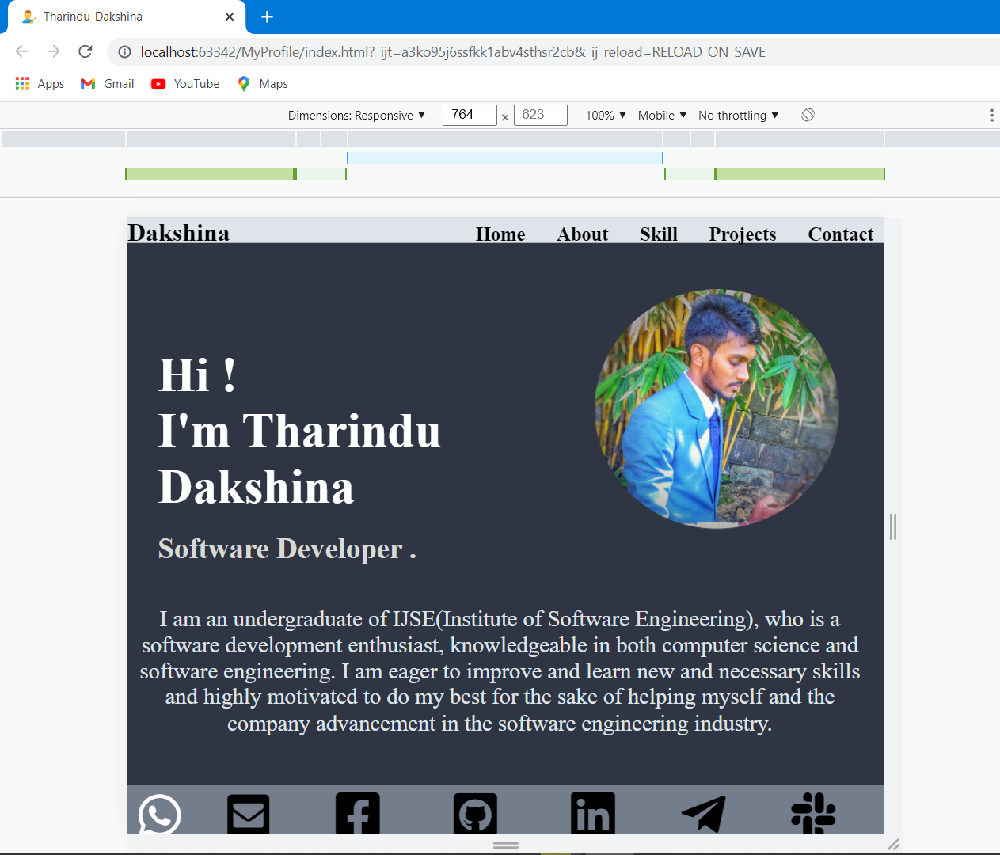

<h1 style="text-align: center; font-size: 50px; color: #f2f5c8"><u>This is my profile.</u></h1>

> #### Hello, I'm Tharindu Dakshina. I'm still learning software engineering at Institute Of Software Engineerin(IJSE).This is about own web site designed by me. This contains five contents like about Home,About , skill that i have, projects and assignments that i developed, and contact details.This is designed by using html and css only.

<ul>
<li style="font-size: 20px"><b>Site Map URL</b> :- <a href="https://www.gloomaps.com/GRrwYlbeTl" target="_blank">https://www.gloomaps.com/GRrwYlbeTl </a></li>
 
<li style="font-size: 20px"><b>Wireframe URL Of My Profile</b> :- <a href="https://wireframe.cc/iVep1K" target="_blank">https://wireframe.cc/iVep1K</a></li>
 
<li style="font-size: 20px"><b>Mockup URL of My Profile designed by figma</b> :- <a href="https://www.figma.com/file/dXUnQCBwTecJ6KMnyx1gaR/My-Profile?node-id=0%3A1" target="_blank">https://www.figma.com/file/dXUnQCBwTecJ6KMnyx1gaR/My-Profile?node-id=0%3A1</a></li>
 
<li style="font-size: 20px"><b>Github My Profile Page URL</b> :- <a href="https://github.com/TharinduDakshina/myProfile" target="_blank">https://github.com/TharinduDakshina/myProfile</a></li>
 
<li style="font-size: 20px"><b>000webhost URL</b> :- <a href="https://tharindudakshina.000webhostapp.com" target="_blank">https://tharindudakshina.000webhostapp.com</a></li>
</ul>

<h3><u><b>Some images of my website</b></u></h3>

 
 

 

 

 

 
